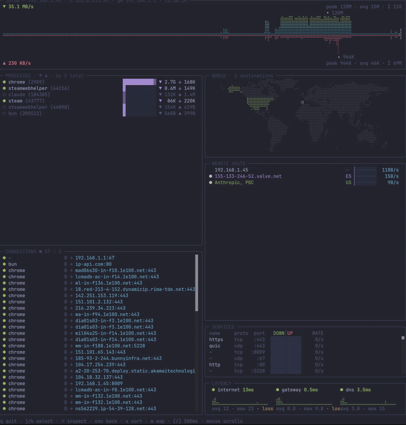

<div align="center">

# iptop

**`htop` for your network.** A beautiful, real-time IP traffic monitor for the terminal.

[](LICENSE)




</div>

## Highlights

- **Braille throughput charts** — mirrored download/upload at 8× block-character resolution, with live rate, peak, and totals
- **Live world map** — your traffic destinations lit up on a braille dot-matrix globe
- **Per-process & per-host bandwidth** — see exactly what's using your network, drill into any process
- **Latency & connections** — continuous ping graphs and every TCP/UDP socket, resolved and GeoIP-tagged
- **No root, no packet capture** — just the tools your OS already ships, refreshed every second

## Quick start

```bash
git clone https://github.com/franlol/iptop && cd iptop
bun install && bun start
```

Or build a standalone binary: `bun run build` → `./dist/iptop`

```bash
iptop --map   # fullscreen world-map wall-art mode
```

## Keys

`j`/`k` select · `⏎` inspect process · `s` sort · `m` map · `q` quit

---

<div align="center">

Built on [Bun](https://bun.sh) · [MIT](LICENSE) © franlol

</div>
